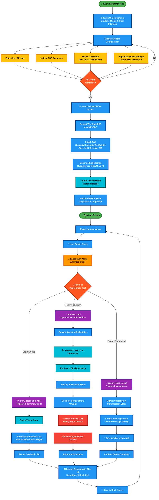

# RAGNALYZE Execution Flow

```mermaid
graph TB
    %% Phase 1: Initialization
    Start([🚀 Start Streamlit App]):::startStyle
    UI[Initialize UI Components<br/>Gradient Theme & Chat Interface]:::processStyle
    
    %% Phase 2: Configuration
    Sidebar[Display Sidebar Configuration]:::processStyle
    API[Enter Groq API Key]:::configStyle
    PDF[Upload PDF Document]:::configStyle
    Model[Select LLM Model<br/>GPT-OSS/LLaMA/Mixtral]:::configStyle
    Settings[Adjust Advanced Settings<br/>Chunk Size, Overlap, K]:::configStyle
    Ready{All Config<br/>Complete?}:::decisionStyle
    
    %% Phase 3: System Setup
    InitBtn[👆 User Clicks Initialize System]:::processStyle
    Extract[Extract Text from PDF<br/>using PyPDF]:::processStyle
    Chunk[Chunk Text<br/>RecursiveCharacterTextSplitter<br/>Size: 1000, Overlap: 200]:::processStyle
    Embed[Generate Embeddings<br/>HuggingFace MiniLM-L6-v2]:::processStyle
    Store[💾 Store in ChromaDB<br/>Vector Database]:::databaseStyle
    RAG[Initialize RAG Pipeline<br/>LangChain + LangGraph]:::processStyle
    SystemReady([✓ System Ready]):::startStyle
    
    %% Phase 4: Query Processing
    WaitQuery[⏳ Wait for User Query]:::processStyle
    UserInput[💬 User Enters Query]:::processStyle
    Agent[🤖 LangGraph Agent<br/>Analyzes Intent]:::agentStyle
    Route{🔀 Route to<br/>Appropriate Tool}:::decisionStyle
    
    %% Phase 5: Tool Execution - Path 1
    ShowTool[🔍 show_feedbacks_tool<br/>Triggered: list/show/top N]:::toolStyle
    QueryDB1[Query Vector Store]:::databaseStyle
    Format1[Format as Numbered List<br/>with Feedback IDs & Pages]:::processStyle
    Response1[Return Feedback List]:::processStyle
    
    %% Phase 5: Tool Execution - Path 2
    RetrieverTool[🔎 retriever_tool<br/>Triggered: search/solutions]:::toolStyle
    Embed2[Convert Query to Embedding]:::processStyle
    Search[🔍 Semantic Search in ChromaDB]:::databaseStyle
    Retrieve[Retrieve K Similar Chunks]:::databaseStyle
    Rank[Rank by Relevance Score]:::processStyle
    Context[Combine Context from Chunks]:::processStyle
    LLM[🧠 Pass to Groq LLM<br/>with Query + Context]:::llmStyle
    Generate[Generate Synthesized Answer]:::llmStyle
    Response2[Return AI Response]:::processStyle
    
    %% Phase 5: Tool Execution - Path 3
    ExportTool[📄 export_chat_to_pdf<br/>Triggered: export/save]:::toolStyle
    History[Extract Chat History<br/>from Session State]:::processStyle
    FormatPDF[Format with ReportLab<br/>User/AI Message Styling]:::processStyle
    SavePDF[💾 Save as chat_export.pdf]:::processStyle
    Response3[Confirm Export Complete]:::processStyle
    
    %% Phase 6: Response & Loop
    Display[📺 Display Response in Chat UI<br/>User Blue / AI Pink-Red]:::processStyle
    SaveHistory[💾 Save to Chat History]:::processStyle
    
    %% Flow Connections
    Start --> UI
    UI --> Sidebar
    Sidebar --> API
    Sidebar --> PDF
    Sidebar --> Model
    Sidebar --> Settings
    API --> Ready
    PDF --> Ready
    Model --> Ready
    Settings --> Ready
    Ready -->|No| Sidebar
    Ready -->|Yes| InitBtn
    
    InitBtn --> Extract
    Extract --> Chunk
    Chunk --> Embed
    Embed --> Store
    Store --> RAG
    RAG --> SystemReady
    
    SystemReady --> WaitQuery
    WaitQuery --> UserInput
    UserInput --> Agent
    Agent --> Route
    
    Route -->|List Queries| ShowTool
    ShowTool --> QueryDB1
    QueryDB1 --> Format1
    Format1 --> Response1
    Response1 --> Display
    
    Route -->|Search Queries| RetrieverTool
    RetrieverTool --> Embed2
    Embed2 --> Search
    Search --> Retrieve
    Retrieve --> Rank
    Rank --> Context
    Context --> LLM
    LLM --> Generate
    Generate --> Response2
    Response2 --> Display
    
    Route -->|Export Command| ExportTool
    ExportTool --> History
    History --> FormatPDF
    FormatPDF --> SavePDF
    SavePDF --> Response3
    Response3 --> Display
    
    Display --> SaveHistory
    SaveHistory --> WaitQuery
    
    %% Styling with high contrast
    classDef startStyle fill:#4CAF50,stroke:#2E7D32,stroke-width:3px,color:#000,font-weight:bold,font-size:16px
    classDef configStyle fill:#FFC107,stroke:#F57F17,stroke-width:3px,color:#000,font-weight:bold,font-size:14px
    classDef processStyle fill:#2196F3,stroke:#0D47A1,stroke-width:3px,color:#fff,font-weight:bold,font-size:14px
    classDef agentStyle fill:#FF9800,stroke:#E65100,stroke-width:3px,color:#000,font-weight:bold,font-size:14px
    classDef toolStyle fill:#9C27B0,stroke:#4A148C,stroke-width:3px,color:#fff,font-weight:bold,font-size:14px
    classDef llmStyle fill:#F44336,stroke:#B71C1C,stroke-width:3px,color:#fff,font-weight:bold,font-size:14px
    classDef databaseStyle fill:#00BCD4,stroke:#006064,stroke-width:3px,color:#000,font-weight:bold,font-size:14px
    classDef decisionStyle fill:#FF5722,stroke:#BF360C,stroke-width:3px,color:#fff,font-weight:bold,font-size:14px
```