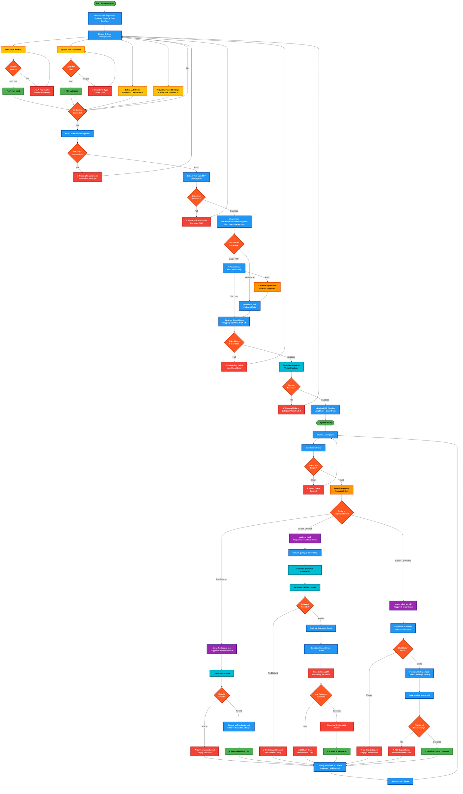

# RAGNALYZE Execution Flow

```mermaid
graph TB
    %% Phase 1: Initialization
    Start([ Start Streamlit App]):::startStyle
    UI[Initialize UI Components<br/>Gradient Theme & Chat Interface]:::processStyle
    
    %% Phase 2: Configuration
    Sidebar[Display Sidebar Configuration]:::processStyle
    API[Enter Groq API Key]:::configStyle
    ValidateAPI{Validate<br/>API Key}:::decisionStyle
    APISuccess[✓ API Key Valid]:::successStyle
    APIFail[✗ API Key Invalid<br/>Show Error Dialog]:::errorStyle
    
    PDF[Upload PDF Document]:::configStyle
    ValidatePDF{Valid PDF<br/>File?}:::decisionStyle
    PDFSuccess[✓ PDF Uploaded]:::successStyle
    PDFFail[✗ Invalid File Type<br/>Show Error]:::errorStyle
    
    Model[Select LLM Model<br/>GPT-OSS/LLaMA/Mixtral]:::configStyle
    Settings[Adjust Advanced Settings<br/>Chunk Size, Overlap, K]:::configStyle
    Ready{All Config<br/>Complete?}:::decisionStyle
    
    %% Phase 3: System Setup
    InitBtn[User Clicks Initialize System]:::processStyle
    CheckPrereq{API Key &<br/>PDF Ready?}:::decisionStyle
    PrereqFail[✗ Missing Requirements<br/>Show Error Message]:::errorStyle
    
    Extract[Extract Text from PDF<br/>using PyPDF]:::processStyle
    ExtractCheck{Extraction<br/>Success?}:::decisionStyle
    ExtractFail[✗ PDF Extraction Failed<br/>Corrupted File?]:::errorStyle
    
    Chunk[Chunk Text<br/>RecursiveCharacterTextSplitter<br/>Size: 1000, Overlap: 200]:::processStyle
    ParallelCheck{Use Parallel<br/>Processing?}:::decisionStyle
    ParallelSplit[⚡ Parallel Split<br/>Multi-Processing]:::processStyle
    SequentialSplit[Sequential Split<br/>Fallback Mode]:::processStyle
    SplitError[✗ Parallel Split Failed<br/>Fallback Triggered]:::warningStyle
    
    Embed[Generate Embeddings<br/>HuggingFace MiniLM-L6-v2]:::processStyle
    EmbedCheck{Embeddings<br/>Generated?}:::decisionStyle
    EmbedFail[✗ Embedding Failed<br/>Model Load Error]:::errorStyle
    
    Store[ Store in ChromaDB<br/>Vector Database]:::databaseStyle
    StoreCheck{Storage<br/>Success?}:::decisionStyle
    StoreFail[✗ ChromaDB Error<br/>Database Write Failed]:::errorStyle
    
    RAG[Initialize RAG Pipeline<br/>LangChain + LangGraph]:::processStyle
    SystemReady([✓ System Ready]):::successStyle
    
    %% Phase 4: Query Processing
    WaitQuery[ Wait for User Query]:::processStyle
    UserInput[ User Enters Query]:::processStyle
    ValidateInput{Query Not<br/>Empty?}:::decisionStyle
    EmptyQuery[✗ Empty Query<br/>Ignored]:::errorStyle
    
    Agent[ LangGraph Agent<br/>Analyzes Intent]:::agentStyle
    Route{Route to<br/>Appropriate Tool}:::decisionStyle
    
    %% Phase 5: Tool Execution - Path 1
    ShowTool[ show_feedbacks_tool<br/>Triggered: list/show/top N]:::toolStyle
    QueryDB1[Query Vector Store]:::databaseStyle
    DB1Check{Results<br/>Found?}:::decisionStyle
    NoResults1[✗ No Feedbacks Found<br/>Empty Database]:::errorStyle
    Format1[Format as Numbered List<br/>with Feedback IDs & Pages]:::processStyle
    Response1[✓ Return Feedback List]:::successStyle
    
    %% Phase 5: Tool Execution - Path 2
    RetrieverTool[ retriever_tool<br/>Triggered: search/solutions]:::toolStyle
    Embed2[Convert Query to Embedding]:::processStyle
    Search[ Semantic Search in ChromaDB]:::databaseStyle
    Retrieve[Retrieve K Similar Chunks]:::databaseStyle
    ResultCheck{Relevant<br/>Results?}:::decisionStyle
    NoResults2[✗ No Relevant Content<br/>Try Different Query]:::errorStyle
    Rank[Rank by Relevance Score]:::processStyle
    Context[Combine Context from Chunks]:::processStyle
    LLM[ Pass to Groq LLM<br/>with Query + Context]:::llmStyle
    LLMCheck{LLM Response<br/>Success?}:::decisionStyle
    LLMFail[✗ LLM API Error<br/>Timeout/Rate Limit]:::errorStyle
    Generate[Generate Synthesized Answer]:::llmStyle
    Response2[✓ Return AI Response]:::successStyle
    
    %% Phase 5: Tool Execution - Path 3
    ExportTool[ export_chat_to_pdf<br/>Triggered: export/save]:::toolStyle
    History[Extract Chat History<br/>from Session State]:::processStyle
    HistoryCheck{Chat History<br/>Exists?}:::decisionStyle
    NoHistory[✗ No Chat to Export<br/>Empty Conversation]:::errorStyle
    FormatPDF[Format with ReportLab<br/>User/AI Message Styling]:::processStyle
    SavePDF[ Save as chat_export.pdf]:::processStyle
    SaveCheck{File Saved<br/>Successfully?}:::decisionStyle
    SaveFail[✗ PDF Export Failed<br/>Permission/Disk Error]:::errorStyle
    Response3[✓ Confirm Export Complete]:::successStyle
    
    %% Phase 6: Response & Loop
    Display[ Display Response in Chat UI<br/>User Blue / AI Pink-Red]:::processStyle
    SaveHistory[ Save to Chat History]:::processStyle
    
    %% Flow Connections - Configuration Phase
    Start --> UI
    UI --> Sidebar
    Sidebar --> API
    API --> ValidateAPI
    ValidateAPI -->|Success| APISuccess
    ValidateAPI -->|Fail| APIFail
    APIFail --> API
    APISuccess --> Ready
    
    Sidebar --> PDF
    PDF --> ValidatePDF
    ValidatePDF -->|Valid| PDFSuccess
    ValidatePDF -->|Invalid| PDFFail
    PDFFail --> PDF
    PDFSuccess --> Ready
    
    Sidebar --> Model
    Sidebar --> Settings
    Model --> Ready
    Settings --> Ready
    
    Ready -->|No| Sidebar
    Ready -->|Yes| InitBtn
    
    %% Flow Connections - Initialization Phase
    InitBtn --> CheckPrereq
    CheckPrereq -->|Fail| PrereqFail
    CheckPrereq -->|Pass| Extract
    PrereqFail --> Sidebar
    
    Extract --> ExtractCheck
    ExtractCheck -->|Fail| ExtractFail
    ExtractCheck -->|Success| Chunk
    ExtractFail --> Sidebar
    
    Chunk --> ParallelCheck
    ParallelCheck -->|Large PDF| ParallelSplit
    ParallelCheck -->|Small PDF| SequentialSplit
    ParallelSplit -->|Error| SplitError
    SplitError --> SequentialSplit
    ParallelSplit -->|Success| Embed
    SequentialSplit --> Embed
    
    Embed --> EmbedCheck
    EmbedCheck -->|Fail| EmbedFail
    EmbedCheck -->|Success| Store
    EmbedFail --> Sidebar
    
    Store --> StoreCheck
    StoreCheck -->|Fail| StoreFail
    StoreCheck -->|Success| RAG
    StoreFail --> Sidebar
    
    RAG --> SystemReady
    
    %% Flow Connections - Query Phase
    SystemReady --> WaitQuery
    WaitQuery --> UserInput
    UserInput --> ValidateInput
    ValidateInput -->|Empty| EmptyQuery
    ValidateInput -->|Valid| Agent
    EmptyQuery --> WaitQuery
    
    Agent --> Route
    
    %% Flow Connections - Tool Path 1
    Route -->|List Queries| ShowTool
    ShowTool --> QueryDB1
    QueryDB1 --> DB1Check
    DB1Check -->|Empty| NoResults1
    DB1Check -->|Found| Format1
    NoResults1 --> Display
    Format1 --> Response1
    Response1 --> Display
    
    %% Flow Connections - Tool Path 2
    Route -->|Search Queries| RetrieverTool
    RetrieverTool --> Embed2
    Embed2 --> Search
    Search --> Retrieve
    Retrieve --> ResultCheck
    ResultCheck -->|No Results| NoResults2
    ResultCheck -->|Found| Rank
    NoResults2 --> Display
    Rank --> Context
    Context --> LLM
    LLM --> LLMCheck
    LLMCheck -->|Fail| LLMFail
    LLMCheck -->|Success| Generate
    LLMFail --> Display
    Generate --> Response2
    Response2 --> Display
    
    %% Flow Connections - Tool Path 3
    Route -->|Export Command| ExportTool
    ExportTool --> History
    History --> HistoryCheck
    HistoryCheck -->|Empty| NoHistory
    HistoryCheck -->|Exists| FormatPDF
    NoHistory --> Display
    FormatPDF --> SavePDF
    SavePDF --> SaveCheck
    SaveCheck -->|Fail| SaveFail
    SaveCheck -->|Success| Response3
    SaveFail --> Display
    Response3 --> Display
    
    %% Final Loop
    Display --> SaveHistory
    SaveHistory --> WaitQuery
    
    %% Styling with high contrast
    classDef startStyle fill:#4CAF50,stroke:#2E7D32,stroke-width:3px,color:#000,font-weight:bold,font-size:16px
    classDef successStyle fill:#4CAF50,stroke:#2E7D32,stroke-width:3px,color:#000,font-weight:bold,font-size:14px
    classDef errorStyle fill:#F44336,stroke:#B71C1C,stroke-width:3px,color:#fff,font-weight:bold,font-size:14px
    classDef warningStyle fill:#FF9800,stroke:#E65100,stroke-width:3px,color:#000,font-weight:bold,font-size:14px
    classDef configStyle fill:#FFC107,stroke:#F57F17,stroke-width:3px,color:#000,font-weight:bold,font-size:14px
    classDef processStyle fill:#2196F3,stroke:#0D47A1,stroke-width:3px,color:#fff,font-weight:bold,font-size:14px
    classDef agentStyle fill:#FF9800,stroke:#E65100,stroke-width:3px,color:#000,font-weight:bold,font-size:14px
    classDef toolStyle fill:#9C27B0,stroke:#4A148C,stroke-width:3px,color:#fff,font-weight:bold,font-size:14px
    classDef llmStyle fill:#F44336,stroke:#B71C1C,stroke-width:3px,color:#fff,font-weight:bold,font-size:14px
    classDef databaseStyle fill:#00BCD4,stroke:#006064,stroke-width:3px,color:#000,font-weight:bold,font-size:14px
    classDef decisionStyle fill:#FF5722,stroke:#BF360C,stroke-width:3px,color:#fff,font-weight:bold,font-size:14px

```
